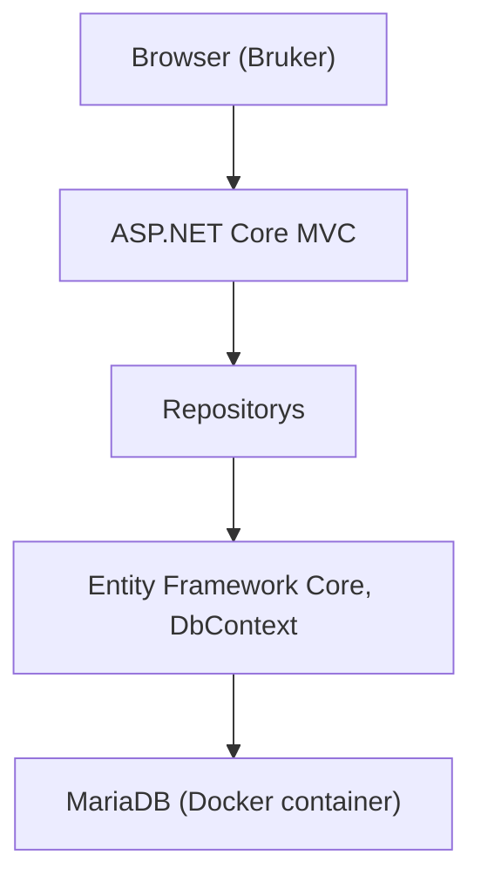

Systemarkitektur for AOR

Applikasjonen AOR er en MVC.NET core webapplikasjon. 
Appen bruker en MariaDB database, og kjøres gjennom docker containere.

Hvordan systemarkitekturen er bygget opp:
- Browser: Brukeren åpner web-appen i en nettleser.
- Appen sender HTTP-forespørsler til ASP.NET Core MVC applikasjonen gjennom Get og Post metoder.
- Controllere i MVC applikasjonen håndterer forespørslene. 
- Der det er behov for å kommunisere med databasen, bruker controllerene Repository mønsteret.
- Repositoryene fungerer som et lag mellom controllere og database, som gjør applikasjonen enklere å vedlikeholde, og bidrar med et sikkerhetslag.
- Repositoryene bruker Entity Framework Core og DbContext for å utføre databaseoperasjoner.
- Entity Framework Core kommuniserer med MariaDB databasen som kjører i en Docker container.

